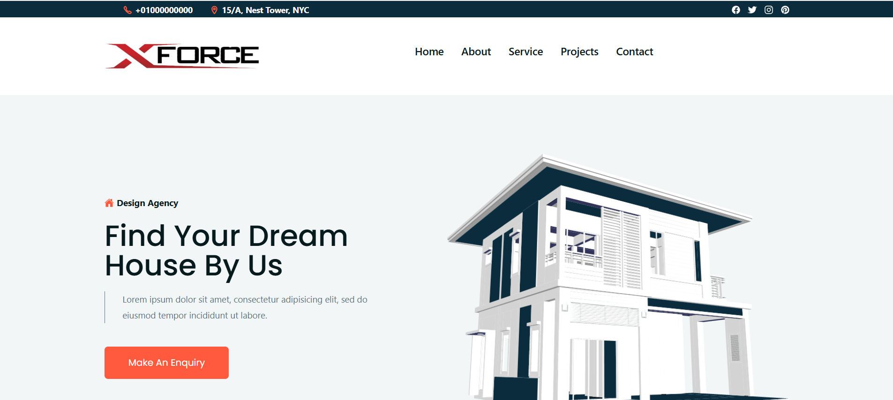
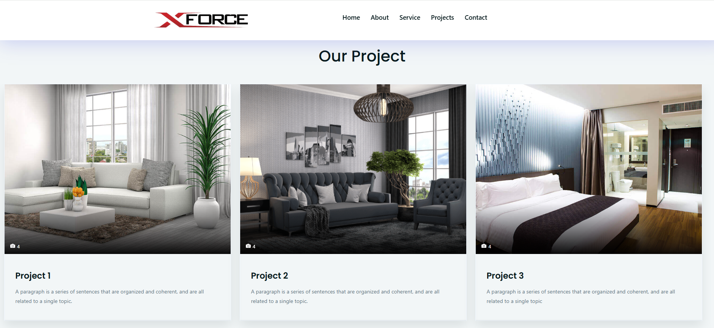
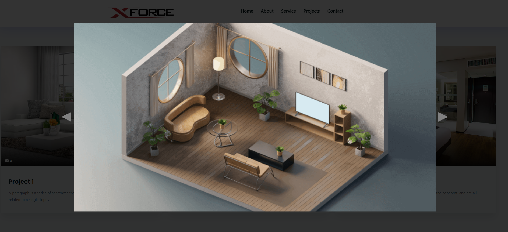
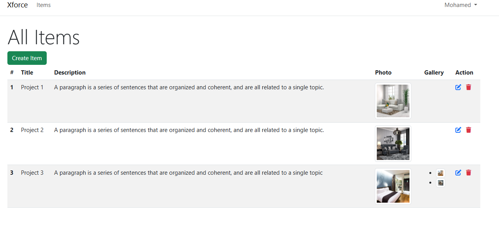

# XForce Design Portfolio Website

XForce is a dynamic portfolio website for a professional interior design company. This project showcases various design projects handled by the company and includes an admin dashboard that allows for dynamic content management such as adding, editing, and deleting projects and galleries.

## 🚀 Features

- 🏠 Modern and responsive front-end design
- 📷 Project gallery with image upload and project descriptions
- 🛠️ Admin dashboard to:
    - Add/Edit/Delete projects
    - Upload photos for each project
- 📱 Fully responsive layout for all devices
- 📂 Organized project sections and service listings

## 💼 Use Case

This platform is developed for a design company to present its portfolio to potential clients. The system allows the company team to manage the content without modifying any code, directly through an admin panel.

## 🔧 Tech Stack

- HTML5, CSS3, Bootstrap
- JavaScript
- PHP / Laravel (if applicable)
- MySQL (for dynamic content)
- Admin Panel (custom or CMS-based)

## 📸 Some Screenshots from Website

### Home Page

### Project Gallery

### Gallary

## 🧑‍💼 Admin Panel

The admin dashboard provides full control over the projects:
- Add new design projects with descriptions and photos
- Edit existing entries
- Delete outdated projects
- Manage the gallery dynamically
